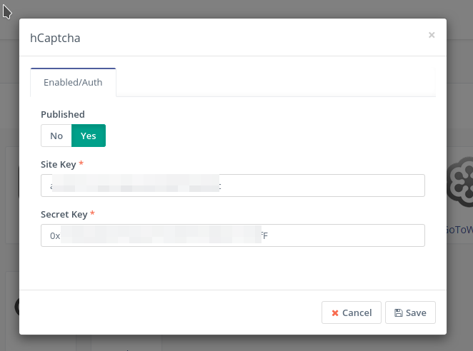
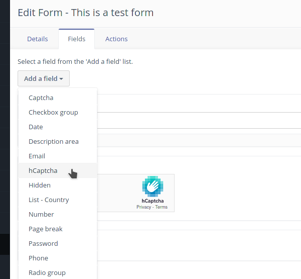
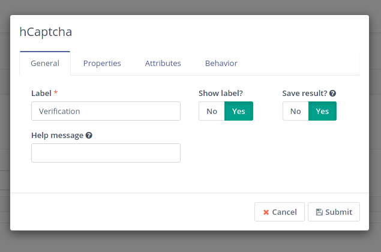
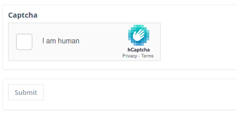

# Mautic 3 hCaptcha Plugin

[](https://packagist.org/packages/collabora/mautic3-hcaptcha)
[](LICENSE)
[](https://www.mautic.org/marketplace/)

This plugin brings hCaptcha integration to mautic 3.X.

This project is nearly exclusively based on the mautic-recaptcha plugin developed by Konstantin Scheumann.

Ideas and suggestions are welcome, feel free to create an issue or PR on Github.

Licensed under GNU General Public License v3.0.

## Installation via composer (preferred)

Execute `composer require collabora/mautic3-hcaptcha` in the main directory of the mautic installation.

## Installation via .zip

1. Download the [master.zip](https://github.com/collaboraproductivity/mautic-hcaptcha/archive/mautic3-hcaptcha.zip), extract it into the `plugins/` directory and rename the new directory to `MauticHcaptchaBundle`.
2. Clear the cache via console command `php bin/console cache:clear --env=prod` (might take a while) *OR* manually delete the `app/cache/prod` directory.

## Configuration

In Mautic, go to `Settings` > `Plugins` and click the `Install/Upgrade Plugins` button located at the top right of the screen.

You should now see a "hCaptcha" plugin. Ensurre `Published`is on `Yes` and specify the site key and site secret.



## Usage in Mautic Form

Go in `Components`> `Forms`, edit a form and click on the button `Add a field` > `hCaptcha`.



Specify a label (mandatory) and click on `Submit`.



Now, if everything has been set up correctly and the keys have been properly specified, you should see the preview of the captcha.



## Patching procedure

The differences between this plugin and the one developed by Konstantin are kept minimal. What we just did to support this plugin is as follow:

1. See commit 5a47951195ee4f141010a54bca40fbd34cfdd393 for the endpoint and form field changes. Change based upon the official [hCaptcha migration guide](https://docs.hcaptcha.com/switch).
2. Bulk replace to hCaptcha:
   ```
    # For PHP constants
    sed -i -- 's/HCAPTCHA/HCAPTCHA/g' $(find . -type f -not -path '*.git*')
    # For PHP variables and namespaces
    sed -i -- 's/Hcaptcha/Hcaptcha/g' $(find . -type f -not -path '*.git*')
    sed -i -- 's/hCaptcha/hCaptcha/g' $(find . -type f -not -path '*.git*')
    sed -i -- 's/hcaptcha/hcaptcha/g' $(find . -type f -not -path '*.git*')
   ```
3. Rename files from recaptcha to hCaptcha
4. Pay attention that in `Integration/HcaptchaIntegration.php`, the name returned by the `getName()` method must be lowercased and start with an uppercase (so Hcaptcha), otherwise the configuration dialog box used for the configuration of the extension will be empty.
